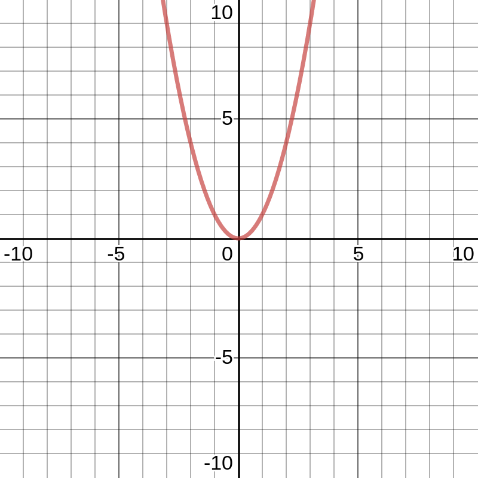
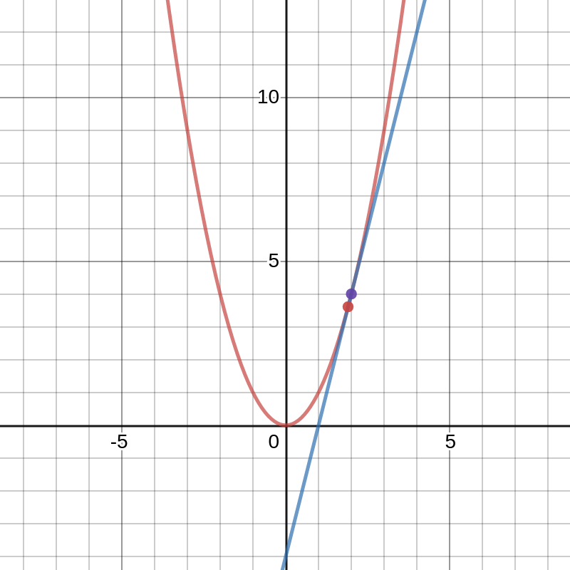

Gradient descent is an iterative algorithm to determine the minimum of any function, let's say f(x). It is mostly used in machine learning algorithm in the process of minimization of cost function in linear regression technique.

For uni-variate function f(x);

$$
x_{i+1} \Rightarrow x_i - \alpha \frac{\partial J(x_i)}{\partial x} 
$$

This value is iterated until we get the stable value for x where $\alpha$ determines the converging rate.

Now how does it help to determine the minima of a function and what advantage can we take from it?

Suppose a function  $f(x) = x^2 $

In graph, the function can be represented as

Let's now determine a tangent at any point of the equation.

As the two points $(x,y)$ and $(x^{\prime}, y^{\prime})$ become closer and closer to each other, the difference between them tends to zero. The slope of the line can be derived as:
$$
\begin{aligned}
  \frac{dy}{dx}&=\frac{y-y^{\prime}}{x-x^{\prime}} \\
  &=\frac{x^2-x^{\prime2}}{x-x^{\prime}} \\
  &=\frac{x^2-(x-\delta x)^2}{x-(x-\delta x)} \because x^{\prime} = x - \delta x \\
  &=\frac{x^2 - x^2 + 2x \delta x - \delta x^2}{\delta x} \because \delta x^2=0\\
  &=\frac{2x \delta x}{\delta x} \\
  &=2x
\end{aligned}
$$

The slope of the equation at any point is either is negative or positive or zero. $\alpha$ is the learning rate always positive. The iterative function,

$$
x \Rightarrow x - \alpha  \frac{df(x)}{dx}
$$

chooses the new value for x, so that it is left to the old value of x when the slope is positive, to the right when the slope is negative and remain the same when the slope is 0, hence gradually taking us to the minimum of the function depending upon the learning rate as the iteration continues and hence determining the value of x where y can be minimum.

How can we use this algorithm for our advantage or more specifically to estimate a linear model which can predict the future values of any scattered data?

Let's suppose a graph of data with single, or two variable or can be more.

Let the red line be h(x). If h(x) is the best function which fits into the data points, then the error that it generates while calculating the values for the y must be minimum.

Error is the distance between the actual value y and the value we estimated from our heuristic function h(x).

$e = | y - h(x) |$

To give more importance to errors in specific data points, we can square the error term. The total sum of square of errors is:

$$
E = \sum_{i=1}^m (y_i-h(x))^2
$$

The cost function can be more generalized to

$
 J(x_1,\dots x_n) =  \min_{x_1,\dots x_n} \frac{1}{2m} \sum_{i=1}^m [y_i - h(x_1,\dots x_n)]
$

Now we need to determine the value for $ x1, x2, ... $ such that the value of cost function is minimum, and we know how to get it. (By Gradient Descent Algorithm)

repeat until convergence {

$$
x_{i+1} \Rightarrow x_i - \alpha \frac{\partial J(x_1, x_2...x_n)}{\partial x_i} 
$$

}

We should be careful while selecting the value of alpha. If $\alpha$ is much smaller, the algorithm converges slowly and if $\alpha$ is very big, algorithm may not converge or in some case may diverge.

